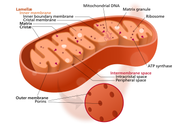
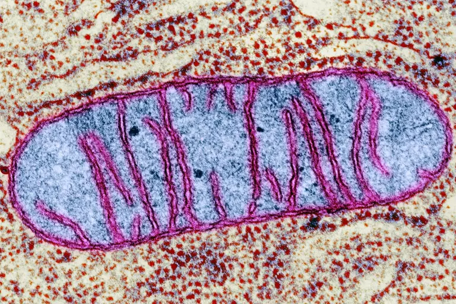

# Agent-based models of mtDNA population dynamics
This project is about modelling clonal expansion. It is for the gold CREST award with [Conor Lawless](https://www.ncl.ac.uk/medical-sciences/people/profile/conorlawless.html) as a mentor.

## Mitochondria
[Mitochondria](https://en.wikipedia.org/wiki/Mitochondrion) are often referred to as 'the powerhouse of the cell'. Mitochondria are a type of sub-unit ([organelle](https://en.wikipedia.org/wiki/Organelle)) in a [cell](https://en.wikipedia.org/wiki/Cell_(biology)) which create energy for a cell using oxygen, fats, sugars and proteins. Mitochondria are also involved in cell death ([apoptosis](https://en.wikipedia.org/wiki/Apoptosis)) which is important because cells which divide too many times result in exessive anumbers of cells, causing tumors.

> Cells have different sub-groups, mitochondria are one of them.

> Diagram of a mitochondrion.

> Image of a mitochondrion

Malfunctioning mitochondria can have [negative health effects](https://www.umdf.org/what-is-mitochondrial-disease-2/0) such as fatigue, muscle weakness and neurodegenerative diseases since they are responsible for making the majority of energy in the body.

## Mitochondrial DNA
Cells which have mitochondria ([eukaryotic](https://biologydictionary.net/eukaryotic-cell/)) not only have DNA in the nucleus but have mitochonrial DNA (mtDNA) in each mitochondrion. mtDNA is significantly smaller than DNA in the nucleus, however, because cells often have many mitochonria and a mitochondrion can have multiple mtDNA, there is many more copies of mtDNA in a cell than nuclear DNA. 

Mutated mtDNA can cause disease if they cannot carry out their function properly.

## Clonal Expansion
[Clonal expansion](https://royalsocietypublishing.org/doi/10.1098/rsob.200061) is when mtDNA mutations increase. It can happen as humans age or because of mitochondrial disease. Larger amounts of mutated mtDNA can also cause mitochondrial diseases.

## Mitochondrial Disease
Mutated mtDNA molecules can cause disease because they code for many mitochondrial proteins.  If mutant mtDNA species reaches sufficiently high levels in the cell then these proteins will not be produced in sufficient quantities to support cell function. The result is mitochondrial dysfunction. 

## Modelling mtDNA
It is important to model mtDNA to gain a better understanding of it so treatment for many different mitochondrial diseases can be developed.

General comments:

It would be good to have a separate section about mito disease.
It would be good to include more references, e.g. to the blog post and review articles I sent to you.
Could you add a section about the technological tools you will use: Python, MESA?

