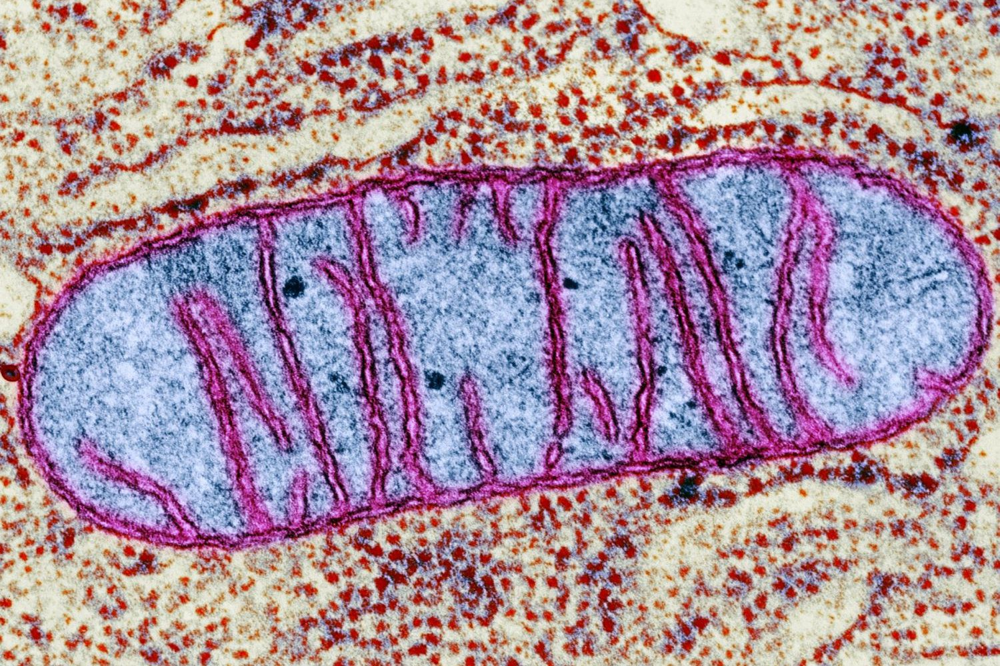

# mtDNA
Modeling mtDNA habits 

## Mitochondria
[Mitochondria](https://www.genome.gov/genetics-glossary/Mitochondria) are often referred to as 'The powerhouse of the cell'. Mitochondria are a type of sub-unit in a cell which create energy for a cell using oxygen, fats, sugars and proteins. Mitochondria are also involved in cell death ([aptosis](https://en.wikipedia.org/wiki/Apoptosis)) which is important because cells which grow too large can cause tumors.

> Cells have different sub-groups, mitochondria are one of them.

> Diagram of a mitochondrion.

> Image of a mitochondrion

Malfunctioning mitochondria can have [negative health effects](https://www.umdf.org/what-is-mitochondrial-disease-2/0) such as fatigue, muscle weakness and neurodegenerative diseases since they are responsible for making the majority of energy in the body.

## Mitochondrial DNA
Cells which have mitochondria ([eukaryotic](https://biologydictionary.net/eukaryotic-cell/)) not only have DNA in the nucleus but have mitochonrial DNA (mtDNA) in each mitochondrion. mtDNA is significantly smaller than DNA in the nucleus, however, because cells often have many mitochonria and a mitochondrion can have multiple mtDNA, there is much more mtDNA in a cell than DNA. 

Mutated mtDNA can cause disease if they cannot carry out their function properly.

