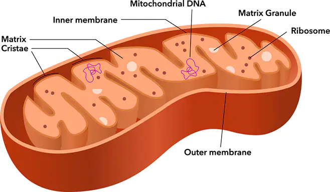

# mtDNA
Modeling mtDNA habits 

## Mitochondria
[Mitochondria](https://www.genome.gov/genetics-glossary/Mitochondria) are often referred to as 'The powerhouse of the cell'. Mitochondria are a type of sub-unit in a cell which create energy for a cell using oxygen, fats, sugars and proteins. Mitochondria are also involved in cell death ([aptosis](https://en.wikipedia.org/wiki/Apoptosis)) which is important because cells which grow too large can cause tumors.

> Cells have different sub-groups, the mitochondria are one of them.

> Diagram of a mitochondria.

Malfunctioning mitochondria can have [negative health effects](https://www.umdf.org/what-is-mitochondrial-disease-2/0) such as fatigue and muscle weakness since they are responsible for making the majority of energy in the body.
