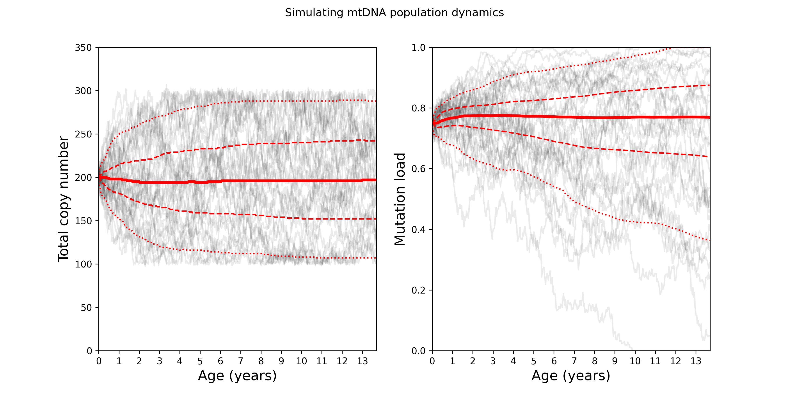
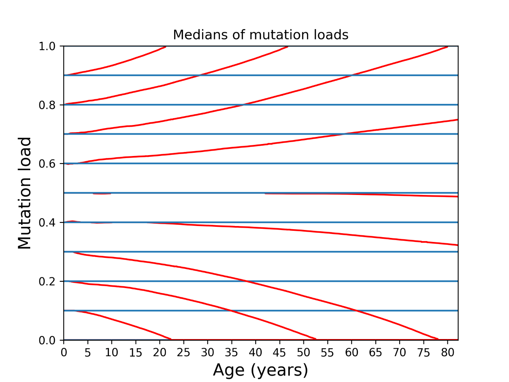

## Modelling mtDNA population dynamics code

### mtDNA_population_dynamics.py

This code creates two side by side plots of the copy number/time and mutation load/time. It draws the 5th, 25th, 50th, 75th, and 95th percentile lines over the plots.

> An example plot the code created

### mtDNA_medians.py

This code created a plot of 11 medians each starting from a different mutation load.

> An example plot the code created
